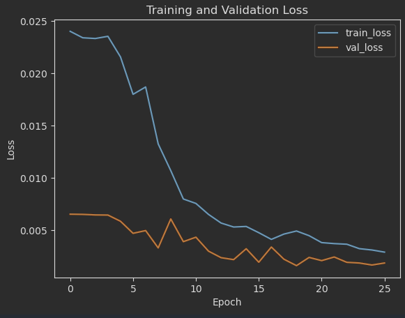

# Self Driving Car Using Convolutional Neural Networks

### Problem Statement
The goal of this project is to develop a deep learning model using a simple convolutional neural network architecture to
predict the turning angle of a self-driving car based on input images from the car's front-facing camera. The model will
be trained on a dataset of images captured from a simulated driving environment, where each image is labeled with the 
corresponding steering angle. The model will learn to predict the appropriate steering angle for a given input image, 
enabling the car to navigate through the simulated environment autonomously.


### Dataset
The dataset used for this project was obtained using the Udacity self-driving simulator, which provides a collection of 
images captured from a front-facing camera mounted on a simulated car. Each image is labeled with the corresponding 
steering angle, which represents the direction the car should turn to navigate the environment. The dataset consists of 
thousands of images, covering various driving scenarios such as straight roads, curves, and intersections. The images are 
preprocessed and augmented to enhance the model's ability to generalize to different driving conditions.

Approximately 80% of the dataset is used for training the model, while the remaining 20% is reserved for testing. 
The training set is further augmented with techniques such as random cropping, flipping, and brightness adjustments to 
improve the model's robustness. The dataset is balanced to ensure that the model learns to predict a wide range of 
steering angles, from sharp turns to straight driving. The data is then loaded into a DataLoader similar to PyTorch, but
modified to work with TensorFlow for efficient batching and shuffling during training. Within the Dataloader, the images 
are normalized and resized to a consistent shape suitable for input into the convolutional neural network. Additionally,
the dataloader is handled to augment the data if it is in the training set, while keeping the test sets unaugmented to
evaluate the model's performance on unseen data.

### Model Architecture
The model architecture is based on a simple convolutional neural network (CNN) designed for regression tasks. The CNN 
consists of several convolutional layers followed by fully connected layers that output a single value representing the 
predicted steering angle. The convolutional layers are responsible for extracting features from the input images, 
while the fully connected layers learn to map these features to the corresponding steering angles. The architecture includes:
1. **Input Layer**: Accepts preprocessed images of shape (height, width, channels).
2. **Convolutional Layers**: Multiple layers with increasing filter sizes and decreasing spatial dimensions and kernels, using ReLU activation functions to capture complex features from the images.
3. **Flatten Layer**: Converts the 2D feature maps from the convolutional layers into a 1D vector.
4. **Fully Connected Layers**: 4 Dense layers with ReLU activations that learn to map the extracted features to the steering angle.
5. **Output Layer**: A single neuron with a linear activation function that outputs the predicted steering angle. 

The model is trained using the Mean Squared Error (MSE) loss function, which measures the average squared difference 
between the predicted steering angles and the true angles in the training data. The Adam optimizer is used to minimize 
the loss during training, with a learning rate of 0.001. The model is trained for a specified number of epochs, with 
early stopping based on validation loss to prevent overfitting. The architecture is designed to be simple yet effective 
for the regression task of predicting steering angles from images, and can be further enhanced with additional layers or 
regularization techniques if needed.

### Results

Despite some overfitting visible in the loss curves, the trained model is able to successfully complete full laps of the 
Udacity simulator track autonomously, navigating curves, straight sections, and the bridge without leaving the road. 
A video demonstration can be found in `outputs/Baseline_CNN_Lap.mp4`.

The training and validation loss curves (shown below) indicate the model is learning but with some gap between training 
and validation loss, suggesting overfitting. Some oscillation is also present, which may be due to the learning rate 
being too high or the data augmentation being too aggressive. Potential improvements include reducing the learning rate, 
adding dropout layers for regularization, and collecting additional training data to help the model generalize further.

 <br>

#### Autonomous Driving Demo
A video of the autonomous driving demo can be found in the `outputs/` directory as `Baseline_CNN_Lap.mp4`. In this demo, 
the trained model is able to drive the full course in the Udacity simulator, successfully navigating through curves. Additionally,
gifs can be found below:

 <br>
 <br>
 <br>

### Challenges

Several challenges were encountered during development and were addressed as follows:

**Data Imbalance:** The majority of recorded frames have a near-zero steering angle because most driving is done on 
straight roads. This caused the model to heavily bias toward predicting zero, making it unable to handle curves. To 
address this, steering angles were grouped into bins and over-represented bins were capped at a threshold (400 samples 
per bin), forcing a more balanced distribution that gives the model enough examples of turns to learn from.

**Road Surface Variation on the Bridge:** The bridge section of the track has a different road texture and narrower lane 
markings compared to the rest of the course. The model initially struggled with this section because it had limited 
exposure to these visual features. This was solved by recording two additional dedicated passes over the bridge 
(`Bridge1/` and `Bridge2/`), giving the model more training samples for that specific scenario.

**Overfitting and Training Instability:** The loss curves showed the model overfitting to training data and exhibiting 
oscillation between epochs. Early stopping with best-weight restoration (patience=7) was used to halt training before 
the model degraded further. Data augmentation (random flips, brightness adjustments) was applied to the training set 
to improve generalization. Despite these measures, some overfitting persists and remains an area for improvement — 
potential next steps include reducing the learning rate, adding dropout layers, and collecting more training data.

**Attention Mechanism Exploration:** After the baseline CNN was working, an attention mechanism was implemented to allow 
the model to consider sequences of past frames (using a window of 20 frames) to better predict whether the car was 
entering or exiting a curve. While the implementation was functional, the increased model complexity combined with the 
limited dataset size meant it did not outperform the simpler baseline CNN. The attention code was removed from the final 
version, but it remains an area for future exploration with a larger dataset.

### How to Use the Model

#### 1. Download the Udacity Simulator
Download the Udacity Self-Driving Car Simulator from [here](https://github.com/udacity/self-driving-car-sim). This 
simulator provides the environment for both data collection and autonomous testing.

#### 2. Set Up the Environment
Create a conda environment and install the required dependencies using the provided `requirements.txt`:
```bash
conda create --name self-driving-car --file requirements.txt
conda activate self-driving-car
```

> **Note:** The `requirements.txt` is a conda-style spec file (platform: win-64). A CUDA-enabled GPU is recommended 
> for training. The model will train on CPU but will be significantly slower.

#### 3. Collect Training Data
Open the simulator in **Training Mode** and record your driving data. Each recording session generates a folder 
containing the captured images and a `driving_log.csv` file with the corresponding steering angles.

Place each recording session as its own sub-folder inside `data/raw/`. Using sub-folders allows you to include multiple 
passes and driving strategies in the dataset. The DataLoader will automatically read across all sub-folders in `data/raw/` 
and combine them into a single dataset. For reference, the data used to train this model was collected as follows:

- **CW** & **CCW**: 5 laps each way (clockwise and counter-clockwise) of smooth, center-lane driving
- **CW_Corrections** & **CCW_Corrections**: 1 lap each way focusing on extreme corrections — intentionally drifting 
  toward lane edges and recording sharp recovery steering back to center
- **Bridge1** & **Bridge2**: 2 extra passes driving over the bridge section, which has different road textures and 
  wider lanes that the model needs additional exposure to

The resulting `data/raw/` folder should look like:
```
data/raw/
├── CW/                  # 5 laps clockwise smooth driving
├── CCW/                 # 5 laps counter-clockwise smooth driving
├── CW_Corrections/      # 1 lap clockwise extreme corrections
├── CCW_Corrections/     # 1 lap counter-clockwise extreme corrections
├── Bridge1/             # Extra bridge pass 1
└── Bridge2/             # Extra bridge pass 2
```

Each sub-folder contains its own `IMG/` directory and `driving_log.csv`. Only center camera images are used for training.

#### 4. Train the Model
Training is done through the Jupyter notebook `notebooks/04_Model_Training.ipynb`. Open the notebook and run all cells. 
The notebook performs the following steps:
1. Loads all data from `data/raw/` sub-folders using the custom `DataLoader`
2. Balances the steering angle distribution by binning angles and capping over-represented bins
3. Splits the data into training (80%) and validation (20%) sets
4. Augments the training data with random flips, brightness adjustments, and other transforms
5. Preprocesses images (crop, convert to YUV, Gaussian blur, resize to 200x66, normalize)
6. Trains the **NVIDIA CNN** model using MSE loss, Adam optimizer (lr=0.001), for up to 50 epochs with early stopping (patience=7, restore best weights)

#### 5. Save the Best Weights
At the end of the training notebook, the model is saved to the `models/` directory. The best weights (restored by early 
stopping) are saved in both `.keras` and `.h5` formats:
```python
model.save("models/nvidia_cnn.keras")
```
Ensure the saved model path matches what `TestSimulation.py` expects (`models/nvidia_cnn.keras`).

#### 6. Run the Autonomous Test
To test the trained model in the simulator:
1. Open the Udacity simulator and select **Autonomous Mode**
2. In a terminal, run the test simulation script:
```bash
python TestSimulation.py
```
3. The script loads the saved model, connects to the simulator via SocketIO, and sends steering and throttle commands 
   in real-time based on the model's predictions from the simulator's front-facing camera feed
4. Watch the car drive itself around the track — the terminal will print the throttle, predicted steering angle, and 
   current speed for each frame

### Project Structure
```
DPS920-Final/
├── MODEL_CARD.md                          # Model documentation (this file)
├── TestSimulation.py                      # Autonomous driving script (connects to simulator)
├── requirements.txt                       # Conda environment dependencies
├── data/
│   └── raw/                               # Training data (one sub-folder per recording session)
│       ├── CW/                            # Clockwise smooth driving laps
│       ├── CCW/                           # Counter-clockwise smooth driving laps
│       ├── CW_Corrections/                # Clockwise extreme correction laps
│       ├── CCW_Corrections/               # Counter-clockwise extreme correction laps
│       ├── Bridge1/                       # Extra bridge pass 1
│       └── Bridge2/                       # Extra bridge pass 2
├── Documentation/
│   └── Final_Project.pdf                  # Course project specification
├── Model/
│   └── CNNModel.py                        # NVIDIA CNN architecture & custom DataLoader
├── models/
│   ├── nvidia_cnn.keras                   # Saved model weights (Keras format)
│   └── nvidia_cnn.h5                      # Saved model weights (HDF5 format)
├── notebooks/
│   ├── 01_EDA.ipynb                       # Exploratory data analysis
│   ├── 02_Data_Balancing.ipynb            # Steering angle distribution & balancing
│   ├── 03_Data_Augmentation.ipynb         # Augmentation strategy exploration
│   └── 04_Model_Training.ipynb            # Model training pipeline
└── outputs/
    ├── model_loss.png                     # Training & validation loss curves
    └── Baseline_CNN_Lap.mp4               # Video of autonomous driving demo
```

### Limitations
**Disclaimer:** This model is intended as a final project and educational purposes. It is not a highly optimized or 
production-ready solution, and should not be used for real-world applications without further development and validation.
